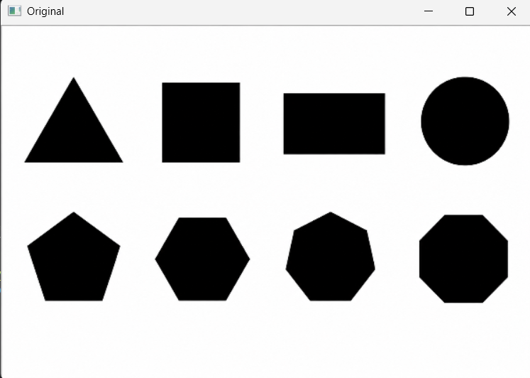
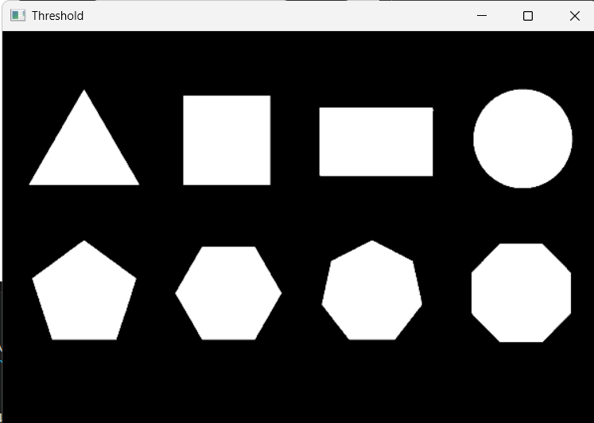
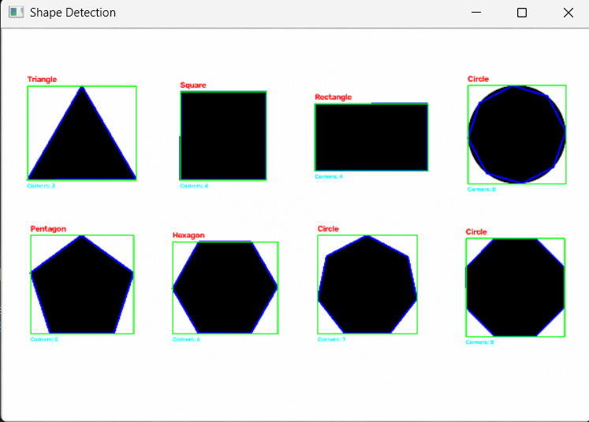

# 🔷 Shape Detection System using OpenCV

A Computer Vision project built with **Python** and **OpenCV** that detects and classifies geometric shapes from an image using classical image processing techniques.

The system identifies shapes such as **Triangle, Square, Rectangle, Pentagon, Hexagon, and Circle** by analyzing contours, approximating their boundaries, and calculating aspect ratios.

---

## 📌 Features

- Detects multiple shapes in a single image
- Converts image to grayscale
- Applies Gaussian Blur to reduce noise
- Uses Binary Thresholding for segmentation
- Finds contours using OpenCV
- Simplifies contours using `cv2.approxPolyDP()`
- Detects shapes based on the number of corners
- Distinguishes Square and Rectangle using Aspect Ratio
- Draws:
  - Contours
  - Bounding Boxes
  - Shape Labels
  - Corner Count
- Saves the final output image

---

## 🛠️ Technologies Used

- Python 3
- OpenCV
- NumPy

---

## 📂 Project Structure

```
Shape-Detection-System/
│
├── images/
│   └── shapes.png
│
├── output/
│   └── result.png
│
├── main.py
├── requirements.txt
├── README.md
└── screenshots/
```

---

## 🚀 How to Run

### 1. Clone the repository

```bash
git clone https://github.com/pranavchinnawar/Shape-Detection-System.git
```

### 2. Move into the project folder

```bash
cd Shape-Detection-System
```

### 3. Install dependencies

```bash
pip install -r requirements.txt
```

### 4. Run the project

```bash
python main.py
```

---

## 🧠 Algorithm

```
Input Image
      │
      ▼
Grayscale Conversion
      │
      ▼
Gaussian Blur
      │
      ▼
Binary Threshold
      │
      ▼
Find Contours
      │
      ▼
Contour Approximation
      │
      ▼
Count Corner Points
      │
      ▼
Aspect Ratio Calculation
      │
      ▼
Shape Classification
      │
      ▼
Draw Labels and Bounding Boxes
```

---

## 🔍 Shape Detection Logic

| Number of Corners | Detected Shape |
|------------------:|----------------|
| 3 | Triangle |
| 4 | Square / Rectangle (using Aspect Ratio) |
| 5 | Pentagon |
| 6 | Hexagon |
| More than 6 | Circle |

---

## 📷 Screenshots

### Original Image



### Threshold Image



### Final Output



---

## 🎯 Learning Outcomes

This project helped me understand:

- Image preprocessing
- Grayscale conversion
- Gaussian Blur
- Binary Thresholding
- Contour Detection
- Contour Approximation (`approxPolyDP`)
- Aspect Ratio
- Shape Classification
- Drawing annotations using OpenCV

---

## 🚀 Future Improvements

- Detect stars and arrows
- Real-time webcam shape detection
- Measure object dimensions
- Detect rotated shapes
- Export detection results to CSV
- Build a GUI using Tkinter or Streamlit

---

## 👨‍💻 Author

**Pranav Chinnawar**

- GitHub: https://github.com/pranavchinnawar
- LinkedIn: https://www.linkedin.com/in/pranav-chinnawar-3870672a4/

---

## ⭐ Support

If you found this project helpful, consider giving it a ⭐ on GitHub!